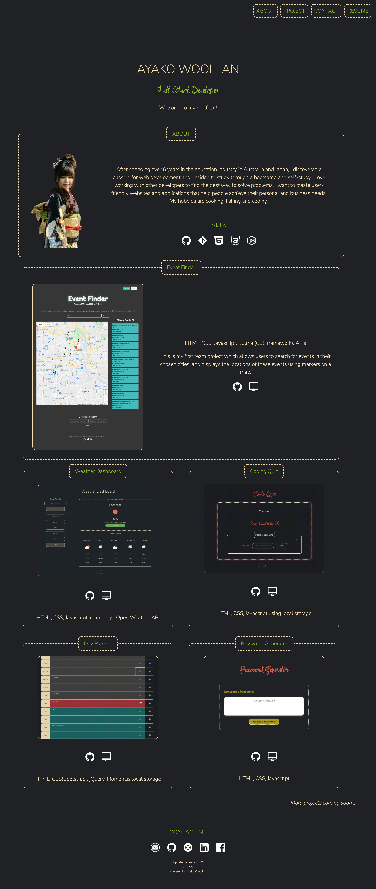

---
  
# Professional Portfolio

  

Table of Contents

  
<ol>
  
<li>
  
<a href="#about-the-project">About The Project</a></li>

  
<ul>
  
<li><a href="#built-with">Built With</a></li>

<li><a href="#usage">Usage</a></>
<li><a href="#license">License</a></>
  
<li><a href="#contact">Contact</a></>
  
</ol>
  

 ## About The Project

 

This is my first professional portfolio using HTML5 and responsive CSS. (flexboz, media queries, and CSS variables)

(<a href="#top">back to top</a>)</>

 ## Built With
* HTML5 
* CSS3
* Flexbox 
* CSS variables

 (<a href="#top">back to top</a>)</>

## Usage

  Following image shows this application's functionality(questions).

## Full size captured image

## Animation

## Mobile view

(<a href="#top">back to top</a>)</>

## License

Distributed under MIT License.

See LICENSE.txt for more information.

(<a href="#top">back to top</a>)</>

 ## Contact Me

Ayako Woollan - ayako.woollan@gmail.com

Project Link: [https://github.com/ayacomputer/02-Portfolio](https://github.com/ayacomputer/02-Portfolio)

(<a href="#top">back to top</a>)</>
